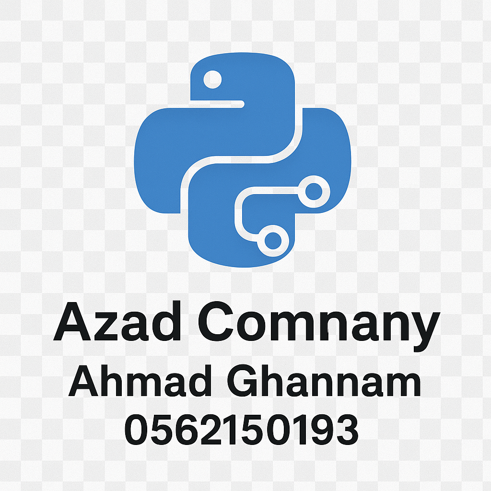

<div align="center">

# 💝 دعم المشروع | Supporting the Project



### **Garage Manager System**
### **نظام إدارة الكراج**

**شكراً لاهتمامك بدعم مشروعنا** 🙏
**Thank you for your interest in supporting our project**

---

</div>

## 🌟 لماذا ندعمكم؟ | Why Support Us?

نظام إدارة الكراج هو نتاج **سنوات من العمل الجاد** والتطوير المستمر. تم تطويره بعناية فائقة في **فلسطين 🇵🇸** بهدف تقديم حل متكامل لإدارة الكراجات والورش.

The Garage Manager System is the result of **years of hard work** and continuous development. It was carefully crafted in **Palestine 🇵🇸** to provide a comprehensive solution for garage and workshop management.

### 💪 ما الذي يتطلبه استمرار المشروع؟

تطوير وصيانة هذا النظام يتطلب:

- ⏰ **آلاف الساعات** من البرمجة والتطوير
- 🔬 **اختبارات مكثفة** لضمان الجودة والاستقرار
- 📚 **كتابة وثائق** شاملة باللغتين العربية والإنجليزية
- 🐛 **إصلاح الأخطاء** والاستجابة للمشاكل
- ✨ **تطوير ميزات جديدة** بناءً على احتياجاتكم
- 💻 **صيانة الخوادم** والبنية التحتية
- 🎓 **تدريب ودعم** المستخدمين

---

## 💖 كيف يمكنك المساعدة؟ | How Can You Help?

### 1️⃣ 💰 الدعم المالي | Financial Support

> **"كل مساهمة، مهما كانت صغيرة، تُحدث فرقاً كبيراً"**
> 
> **"Every contribution, no matter how small, makes a huge difference"**

دعمك المالي يساعدنا على:
- ⚡ **تسريع التطوير** وإطلاق ميزات جديدة
- 🛠️ **تحسين الدعم الفني** والاستجابة السريعة
- 📖 **تطوير الوثائق** والموارد التعليمية
- 🌍 **الوصول لمستخدمين أكثر** حول العالم
- 🇵🇸 **دعم المطورين الفلسطينيين** وتشجيع الإبداع المحلي

#### 💳 طرق الدعم المالي

<div align="center">

```
┌──────────────────────────────────────────────────────────────┐
│                                                              │
│  ☕  قهوة واحدة تساوي ساعة من التطوير                       │
│     One coffee equals one hour of development                │
│                                                              │
│  🍕  بيتزا واحدة تساوي يوم من البرمجة                      │
│     One pizza equals one day of coding                       │
│                                                              │
│  🎉  تبرع شهري يساوي ميزة جديدة                            │
│     Monthly donation equals a new feature                    │
│                                                              │
└──────────────────────────────────────────────────────────────┘
```

</div>

##### 🌐 المنصات الإلكترونية

<table align="center">
<tr>
<td align="center" width="33%">

**☕ Buy Me a Coffee**

[](https://buymeacoffee.com/azadsystems)

تبرعات لمرة واحدة أو شهرية

</td>
<td align="center" width="33%">

**💖 GitHub Sponsors**

[](https://github.com/sponsors/azadsystems)

دعم شهري عبر GitHub

</td>
<td align="center" width="33%">

**💰 PayPal**

[](https://paypal.me/azadsystems)

تبرعات فورية آمنة

</td>
</tr>
</table>

##### 🏦 التحويل البنكي المباشر | Bank Transfer

للتبرعات الكبيرة أو المؤسسية:

```
Bank Name: Bank of Palestine
Account Name: Azad Smart Systems
Account Number: [Contact us]
IBAN: [Contact us]
SWIFT/BIC: [Contact us]

للحصول على التفاصيل الكاملة:
📧 Email: finance@azad-systems.com
```

##### 💱 العملات الرقمية | Cryptocurrency

نقبل التبرعات بالعملات الرقمية:

```
Bitcoin (BTC):     [Contact us]
Ethereum (ETH):    [Contact us]
USDT (TRC20):      [Contact us]

للحصول على العناوين:
📧 Email: crypto@azad-systems.com
```

---

### 2️⃣ 🤝 المساهمة بالوقت والجهد | Contributing Time & Effort

ليس لديك إمكانية مالية؟ لا مشكلة! يمكنك المساهمة بطرق أخرى:

#### 👨‍💻 المساهمة في الكود

- 🐛 **إصلاح الأخطاء** (Bug Fixes)
- ✨ **تطوير ميزات جديدة** (New Features)
- 🎨 **تحسين التصميم** (UI/UX Improvements)
- ⚡ **تحسين الأداء** (Performance Optimization)

```bash
# ابدأ المساهمة الآن
git clone https://github.com/azadsystems/garage_manager.git
git checkout -b feature/my-awesome-feature
# ... make your changes
git commit -m "Add: awesome feature"
git push origin feature/my-awesome-feature
# ثم افتح Pull Request
```

#### 📖 تحسين الوثائق

- ✍️ **كتابة دروس تعليمية** (Tutorials)
- 🌍 **ترجمة الوثائق** (Translation)
- 📝 **إضافة أمثلة** (Code Examples)
- 🎥 **إنشاء فيديوهات تعليمية** (Video Tutorials)

#### 🐛 الإبلاغ عن الأخطاء

- 🔍 **اختبار النظام** وإيجاد الأخطاء
- 📋 **توثيق المشاكل** بشكل واضح ومفصل
- 💡 **اقتراح حلول** للمشاكل الموجودة

#### 💬 الدعم المجتمعي

- ❓ **الإجابة على الأسئلة** في المنتدى
- 🎓 **مساعدة المستخدمين الجدد**
- 📢 **نشر المشروع** بين معارفك
- ⭐ **إعطاء نجمة** على GitHub

---

### 3️⃣ 🌟 نشر المشروع | Spread the Word

أحد أفضل الطرق لدعمنا هو **نشر المشروع**:

<div align="center">

#### ⭐ أعطِ نجمة على GitHub

[](https://github.com/azadsystems/garage-manager)

**النجوم تساعدنا في الوصول لمطورين أكثر!**

---

#### 📢 شارك على وسائل التواصل

[](https://twitter.com/intent/tweet?text=Check%20out%20Garage%20Manager%20System!&url=https://github.com/azadsystems/garage-manager&hashtags=GarageManager,OpenSource,Palestine)
[](https://www.facebook.com/sharer/sharer.php?u=https://github.com/azadsystems/garage-manager)
[](https://www.linkedin.com/sharing/share-offsite/?url=https://github.com/azadsystems/garage-manager)

</div>

- 🐦 **غرد** عن المشروع مع الهاشتاج #GarageManager
- 📘 **شارك** على فيسبوك ولينكدإن
- 📺 **اكتب مقالة** أو سجل فيديو عن تجربتك
- 🎤 **تحدث** عن المشروع في الفعاليات التقنية

---

### 4️⃣ 💼 الترخيص التجاري | Commercial License

إذا كنت تستخدم النظام **تجارياً**، فالرجاء الحصول على ترخيص رسمي:

<div align="center">

```
╔══════════════════════════════════════════════════════════════╗
║                                                              ║
║  💼  الاستخدام التجاري يتطلب ترخيصاً رسمياً              ║
║     Commercial use requires an official license             ║
║                                                              ║
║  شراء ترخيص تجاري هو أفضل طريقة لدعم المشروع              ║
║  واستمراريته على المدى الطويل                             ║
║                                                              ║
╚══════════════════════════════════════════════════════════════╝
```

**📧 اتصل بنا:** sales@azad-systems.com
**💰 أسعار تنافسية** ابتداءً من $499 سنوياً

</div>

---

## 🎁 مزايا الداعمين | Supporter Benefits

### ⭐ الداعمون الفضيون ($5-20 شهرياً)

- ✅ اسمك في قائمة الداعمين
- 📧 رسالة شكر شخصية
- 🏅 شارة "Supporter" في المجتمع

### 🥈 الداعمون الفضيون ($20-50 شهرياً)

- ✅ كل مزايا المستوى السابق
- 🎫 دعم فني ذو أولوية
- 📱 وصول مبكر للميزات الجديدة
- 💬 دعوة لمجموعة Telegram الخاصة

### 🥇 الداعمون الذهبيون ($50-100 شهرياً)

- ✅ كل مزايا المستويات السابقة
- 🎯 التأثير في خارطة الطريق
- 💼 استشارة تقنية شهرية (ساعة واحدة)
- 🎁 خصم 20% على التراخيص التجارية
- 🌟 شعارك على صفحة الداعمين

### 💎 الداعمون الماسيون ($100+ شهرياً)

- ✅ كل مزايا المستويات السابقة
- 👑 دعم فني VIP على مدار الساعة
- 🛠️ ميزات مخصصة حسب الطلب
- 📊 تقارير تطوير شهرية حصرية
- 🤝 شراكة استراتيجية مع الشركة
- 🎓 تدريب مخصص لفريقك

---

## 🏆 قائمة الداعمين | Hall of Fame

### 💎 الداعمون الماسيون

<div align="center">

**شكراً لداعمينا المميزين!**

_كن أول داعم ماسي واحصل على مكانك هنا!_

</div>

### 🥇 الداعمون الذهبيون

<div align="center">

_قائمة الداعمين الذهبيين قيد الإنشاء..._

**هل تريد أن يكون اسمك هنا؟**

</div>

### 🥈 الداعمون الفضيون

<div align="center">

شكراً لكل من ساهم في دعم هذا المشروع!

</div>

---

## 🇵🇸 دعم فلسطين | Supporting Palestine

عندما تدعم هذا المشروع، فإنك **تدعم المبرمجين والمطورين الفلسطينيين**:

- 💼 **توفير فرص عمل** للشباب الفلسطيني
- 🎓 **تشجيع التعليم** والتطوير الذاتي
- 🌍 **وضع فلسطين على خارطة التقنية** العالمية
- 💪 **دعم الصمود** من خلال الإبداع والابتكار
- 🕊️ **بناء جسور** مع العالم من خلال التكنولوجيا

<div align="center">

```
╔════════════════════════════════════════════════════════════╗
║                                                            ║
║  🇵🇸  "دعمك لنا هو دعم لفلسطين وشبابها المبدع"         ║
║     "Supporting us is supporting Palestine                 ║
║      and its creative youth"                               ║
║                                                            ║
╚════════════════════════════════════════════════════════════╝
```

</div>

---

## 📊 شفافية الإنفاق | Spending Transparency

نحن ملتزمون بالشفافية الكاملة في كيفية استخدام التبرعات:

### 💰 توزيع الميزانية

```
📊 كيف نستخدم تبرعاتكم؟

▓▓▓▓▓▓▓▓▓▓▓▓▓▓▓░░░░░  65%  التطوير والبرمجة
▓▓▓▓▓▓░░░░░░░░░░░░░░  25%  البنية التحتية والخوادم
▓▓░░░░░░░░░░░░░░░░░░  10%  التسويق والنشر

───────────────────────────────────────────────────
💻 65% - رواتب المطورين ومكافآت المساهمين
🖥️ 25% - استضافة، خوادم، أدوات تطوير
📢 10% - تسويق، وثائق، دعم المجتمع
```

### 📈 تقارير شهرية

نصدر تقريراً شهرياً عن:
- 💵 إجمالي التبرعات المستلمة
- 📊 توزيع النفقات
- ✨ الميزات التي تم تطويرها
- 🎯 الأهداف المحققة والقادمة

**اشترك في التقارير:** newsletter@azad-systems.com

---

## ❓ أسئلة شائعة | FAQ

### س: هل التبرع إلزامي لاستخدام النظام؟

**ج:** لا، النظام **مجاني تماماً** للاستخدام الشخصي والتعليمي. التبرع اختياري ويساعدنا على الاستمرار في التطوير.

### س: ماذا لو لم أستطع التبرع مالياً؟

**ج:** لا مشكلة على الإطلاق! يمكنك المساهمة بطرق أخرى كثيرة مثل البرمجة، الوثائق، نشر المشروع، أو حتى مجرد إعطاء نجمة على GitHub.

### س: هل التبرعات معفاة من الضرائب؟

**ج:** نحن لسنا منظمة غير ربحية مسجلة، لذلك التبرعات قد لا تكون معفاة من الضرائب. استشر محاسبك للتأكد.

### س: كيف أعرف أن تبرعي وصل؟

**ج:** ستتلقى تأكيداً بالبريد الإلكتروني فوراً بعد التبرع، وسنتواصل معك شخصياً للشكر.

### س: هل يمكنني التبرع باسم شركتي؟

**ج:** بالتأكيد! سنضيف شعار شركتك على صفحة الداعمين (للتبرعات الذهبية والماسية).

### س: ماذا يحدث إذا توقفت عن الدعم الشهري؟

**ج:** لا مشكلة! يمكنك إلغاء الدعم الشهري في أي وقت دون أي التزامات. نقدر أي دعم مهما كانت مدته.

---

## 📞 تواصل معنا | Contact Us

<div align="center">

### 💬 هل لديك أسئلة حول الدعم؟

نحن هنا للإجابة على جميع استفساراتك!

</div>

<table align="center">
<tr>
<td align="center">

**📧 البريد الإلكتروني**

General: info@azad-systems.com
Donations: finance@azad-systems.com
Sales: sales@azad-systems.com

</td>
<td align="center">

**💬 وسائل التواصل**

📱 WhatsApp: +970-XXX-XXXX
💬 Telegram: @azadsystems
🐦 Twitter: @azadsystems

</td>
</tr>
</table>

<div align="center">

**🌐 الموقع الرسمي:** https://azad-systems.com/support

</div>

---

## 🙏 شكراً جزيلاً | Thank You So Much

<div align="center">

### **كل دعم، كل مساهمة، كل كلمة تشجيع**
### **تعني لنا العالم!**

```
  💙  شكراً من القلب  💙
  Thank you from the heart
```

**نتطلع لرؤية اسمك في قائمة الداعمين!**

---

### **Made with ❤️ in Palestine 🇵🇸**
### **صُنع بكل حب في فلسطين**

**Azad Smart Systems Company**
**شركة أزاد للأنظمة الذكية**

---

[](https://azad-systems.com/donate)
[](https://github.com/azadsystems/garage-manager)

</div>

